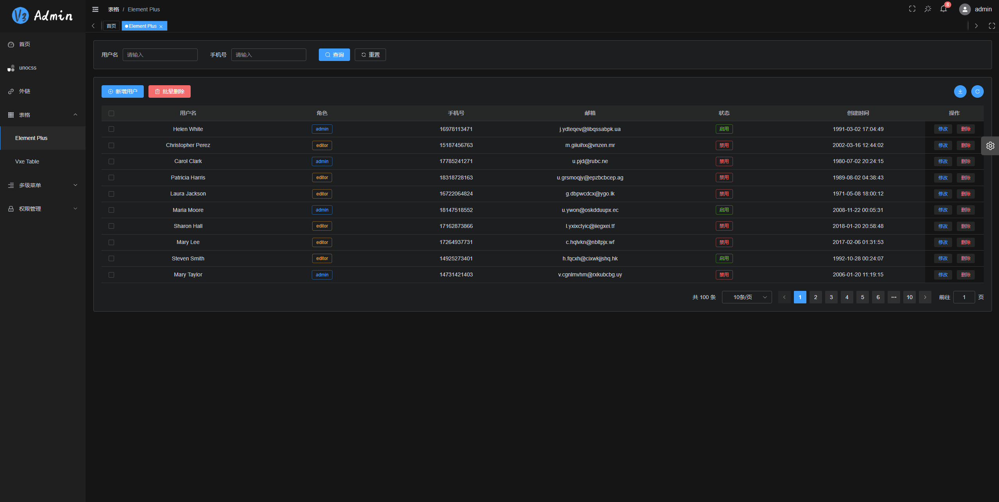
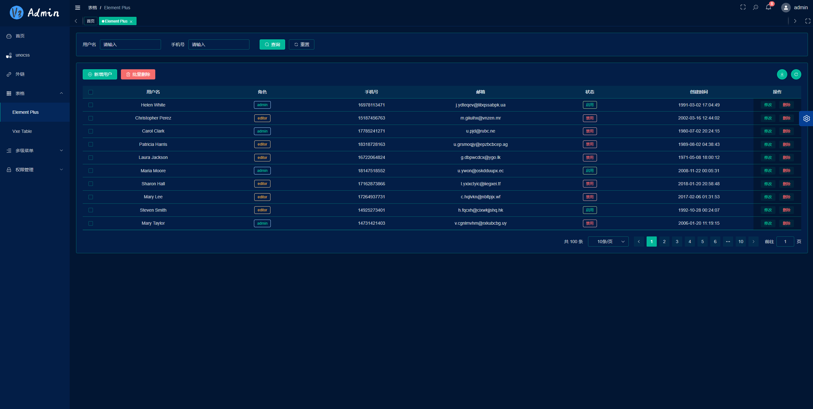

<div align="center">
  
  <h1>V3 Admin Vite</h1>
  <span>English | <a href="./README.zh-CN.md">中文</a></span>
</div>

## ⚡ Introduction

V3 Admin Vite is a free and open source middle and background management system basic solution, based on mainstream framework such as Vue3, TypeScript, Element Plus, Pinia and Vite

- Vue Cli 5.x: [v3-admin](https://github.com/un-pany/v3-admin)
- Electron desktop: [v3-electron-vite](https://github.com/un-pany/v3-electron-vite)

China repository: [Gitee](https://gitee.com/un-pany/v3-admin-vite)

## 📚 Document

- Chinese documentation: [link](https://juejin.cn/post/7089377403717287972)
- Chinese getting started tutorial: [link](https://juejin.cn/column/7207659644487139387)

## 📺 Online preview

| Location     | account             | Link                                            |
| ------------ | ------------------- | ----------------------------------------------- |
| github-pages | `admin` or `editor` | [link](https://un-pany.github.io/v3-admin-vite) |

## ❤️ Generate electricity with love

- **Completely free**：But hopefully you order a star !!!
- **Very concise**：No complicated encapsulation, no complicated type gymnastics, out of the box
- **Detailed annotations**：Each configuration item is written with as detailed comments as possible
- **Latest dependencies**: Regularly update all third-party dependencies to the latest version
- **Very specification**: The code style is unified, the naming style is unified, and the comment style is unified

## Feature

- **Vue3**：The latest Vue3 composition API using Vue3 + script setup
- **Element Plus**：Vue3 version of Element UI
- **Pinia**: An alternative to Vuex in Vue3
- **Vite**：Really fast
- **Vue Router**：router
- **TypeScript**：JavaScript With Syntax For Types
- **PNPM**：Faster, disk space saving package management tool
- **Scss**：Consistent with Element Plus
- **CSS variable**：Mainly controls the layout and color of the item
- **ESlint**：Code verification
- **Prettier**： Code formatting
- **Axios**: Promise based HTTP client (encapsulated)
- **UnoCSS**: Real-time atomized CSS engine with high performance and flexibility
- **Mobile Compatible**: The layout is compatible with mobile page resolution

## Functions

- **User management**: log in, log out of the demo
- **Authority management**: Built-in page permissions (dynamic routing), instruction permissions, permission functions
- **Multiple Environments**: Development, Staging, Production
- **Multiple themes**: Normal, Dark, Dark Blue, theme modes
- **Multiple layouts**：Built-in left, top, left-top three layout modes
- **Error page**: 403, 404
- **Dashboard**: Display different Dashboard pages according to different users
- **Other functions**：SVG, Dynamic Sidebar, Dynamic Breadcrumb Navigation, Tabbed Navigation, Screenfull, Adaptive Shrink Sidebar, HooK (Composables)

## 🚀 Development

```bash
# configure
1. installation of the recommended plugins in the .vscode directory
2. node version 16+
3. pnpm version 8.x

# clone
git clone https://github.com/un-pany/v3-admin-vite.git

# enter the project directory
cd v3-admin-vite

# install dependencies
pnpm i

# start the service
pnpm dev
```

## ✔️ Preview

```bash
# stage environment
pnpm preview:stage

# prod environment
pnpm preview:prod
```

## 📦️ Multi-environment packaging

```bash
# build the stage environment
pnpm build:stage

# build the prod environment
pnpm build:prod
```

## 🔧 Code inspection

```bash
# code formatting
pnpm lint

# unit test
pnpm test
```

## Git commit specification reference

- `feat` add new functions
- `fix` Fix issues/bugs
- `perf` Optimize performance
- `style` Change the code style without affecting the running result
- `refactor` Re-factor code
- `revert` Undo changes
- `test` Test related, does not involve changes to business code
- `docs` Documentation and Annotation
- `chore` Updating dependencies/modifying scaffolding configuration, etc.
- `workflow` Work flow Improvements
- `ci` CICD
- `types` Type definition
- `wip` In development

## Project preview





## 💕 Contributors

Thanks to all the contributors!

<a href="https://github.com/un-pany/v3-admin-vite/graphs/contributors">
  
</a>

## 💕 Thanks star

Small projects are not easy to get a star, if you like this project, welcome to support a star! This is the only motivation for the author to maintain it on an ongoing basis (whisper: it's free after all)

#### git commit message 信息校验

安装：
1、npx husky add .husky/commit-msg 'npx --no-install commitlint --edit "$1"'
2、npx husky add .husky/pre-commit "npx lint-staged"

commitlint 推荐我们使用 config-conventional 配置去写 commit
提交格式（注意冒号后面有空格）
git commit -m <type>[optional scope]: <description>

type ：用于表明我们这次提交的改动类型，是新增了功能？还是修改了测试代码？又或者是更新了文档？
optional scope：一个可选的修改范围。用于标识此次提交主要涉及到代码中哪个模块。
description：一句话描述此次提交的主要内容，做到言简意赅。

##### 常用的 type 类型

| 类型     | 描述                                                   |
| -------- | ------------------------------------------------------ |
| build    | 编译相关的修改，例如发布版本、对项目构建或者依赖的改动 |
| chore    | 其他修改, 比如改变构建流程、或者增加依赖库、工具等     |
| ci       | 持续集成修改                                           |
| docs     | 文档修改                                               |
| feat     | 新特性、新功能                                         |
| fix      | 修改 bug                                               |
| perf     | 优化相关，比如提升性能、体验                           |
| refactor | 代码重构                                               |
| revert   | 回滚到上一个版本                                       |
| style    | 代码格式修改, 注意不是 css 修改                        |
| test     | 测试用例修改                                           |

    总结：commit like this
        1，commit -m 'feact(home): 航空母舰上线'
        2，commit -m 'styles(home): 导航颜色调整'
        3，commit -m 'fix(home): 登陆白屏问题修复'
        4，commit -m 'docs(home): 组建丰富，添加XX组建'

###### 说明

    1，本库采用commit校验，如果需要在编译时校验，在webpcak.base.config.js中放开eslint-loader即可。
    2，components组建内，包含目前百安居常用的组建，基本满足百安居后台管理系统的组建化要求。
    3, husky 配置文件需要将行尾换行符CRLF 更换为 LF
